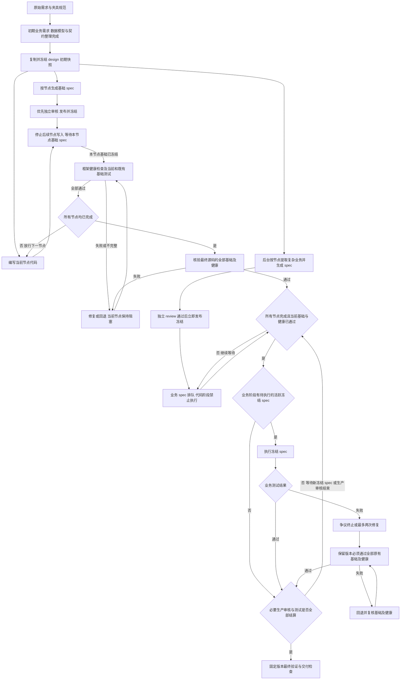

# 权威基础测试逐节点放行与业务测试收尾报告

日期：2026-09-30。用途：记录统一权威测试流水线的目标协议、改造原因、已实施内容与代码复核结果。本次已修改正式平台适配运行时，完成单元回归和真实本地 Playwright 验证；没有调用模型或重跑线上评测。正文的改造前观察与目标验收保留为设计依据，实际落地范围、测量及未完成的增强项见“实施与修改后代码复核”与末尾“参考分析的再次复核与修正”。

保留现有权威测试体系，不加入程序员生成代码后的自测、补测或作者预期验收环节。测试仍依据需求独立生成和审核，程序员读取已准入测试及失败证据来修复应用。机械生成的入口和基础测试提前独立 review、确认、发布并冻结；每个节点代码写完，必须等待对应节点的基础 spec 发布冻结，在当前源码上测试通过后，才允许继续写下一个节点。基础 spec 未冻结、未测试或测试未通过，都不得放行后续节点。

复杂业务逻辑的提取、生成和审核可以在代码生成期间继续后台推进，仍以节点为单位审核通过即交付冻结，但此时只排队，不执行、不驱动业务修复。等所有节点代码完成且基础测试全部通过后，才进入复杂业务测试阶段；已有冻结 spec 开始执行，随后新 review 通过并冻结的 spec 到达就继续运行，直到全部必要业务审核结束、获批 spec 全部冻结并完成测试及有界失败处理。

复杂业务测试被程序员明确质疑时，标注争议后终止该用例，不再复审或实现；程序员认可测试但两次修复仍未通过时，可以自行决定保留代码，但保留版本必须通过原先已通过的基础测试及框架健康检查。

应用写入、测试产物修改和测试驱动的代码修复都需相应静态检查与回退机制。不能因追求业务测试通过，把不可构建、不可启动或关键页面崩溃的版本交付为完成结果。

实施顺序为初期业务需求、数据模型与契约整理完成并复制冻结快照 → 可靠交接与可用版本回退 → 基础 spec 提前审核冻结、节点逐个测试放行 → 全部节点完成后持续执行业务 spec 和有界修复 → 有界并发与预算优化。

## 范围与现有形式

本报告采用统一权威测试流程，不再提供全局测试模式选择。没有官方 spec 时，机械编译和模型生成的用例都是派生权威测试候选，须经独立审核、发布冻结才能按各自范围执行和记账；有官方 spec 时保留官方预期与只读套件，代码作者不得修改官方测试。

官方 spec 按原文件哈希冻结，在外部 manifest 中标明基础或业务范围，并执行相同阶段门。只有能独立筛选且不会通过共享 hooks 提前执行业务的官方基础用例，才用于逐节点基础门；混合文件无法安全拆分时整份留到最终业务阶段，从原始需求另行生成并独立审核基础 spec。不能为提速改写官方断言，或借“官方套件”提前执行复杂业务。

移除全局 test mode 参数及设置，不再有 `fast` 模式或相关代码，也不保留 `full/fast` 的切换、别名或兼容开关。不引入作者自测体系或作者可写测试。基础 spec 独立审核冻结后逐节点测试放行、全部节点完成后执行业务测试，以及静态检查、基础保护与回退，统一成为必经流程。

初始测试审核仍独立于应用实现，以冻结的需求、适用祖先约束、夹具规范和测试依赖为依据，不读取应用代码或实际输出来制定预期。基础入口与复杂业务是同一权威体系中执行阶段不同的两类用例，不改变需求的解释权。基础 spec 的独立批准、正式发布与冻结共同构成节点准入证据；单有候选文件或 smoke 标签不足以放行。

## 移除全局 test mode 参数和快速模式代码

本次改造必须删除 `OCTOS_ARC_TEST_MODE` 的读取、默认值、配置项、启动传参和文档示例；其他同类全局测试模式字段一并清理。不通过把值固定为某种模式来保留旧路由，也不新增另一个开关替代它。

| 清理位置 | 要求 |
| --- | --- |
| 参数与配置 | 删除环境变量、CLI 或配置文件中的测试模式设置；启动、部署、恢复及打包不再传入或保存该参数 |
| 模式判断与执行分支 | 删除 `fast_test_mode`、`fast_derived_acceptance` 和所有依赖模式判断的生成、审核、准入、执行、修复与收尾分支，统一使用本文流程 |
| 准入和状态 | 删除 `skip_review` 等跳过审核的可执行状态与放行路径；基础和业务候选都必须获得有效独立批准并发布冻结 |
| 文档、指标与回放 | README、提示说明、指标字段和测试夹具不再要求或展示模式选择；移除快速模式专用测试，保留统一准入、安全回退和阶段门槛的验证 |

改造前相关入口包括 [参数和流程实现](/home/chris/Works/octos-arc/arc/main.py)、[准入状态](/home/chris/Works/octos-arc/arc/derived_case_review.py) 与 [参数说明](/home/chris/Works/octos-arc/arc/README.md)。删除应覆盖所有调用方，不只是隐藏 README 参数或停止暴露选项；源码中不得继续留下可触发的快速模式旁路。

恢复记录只携带需求、契约副本、冻结套件、源码、当前节点、执行阶段和停止状态等实际流程证据，不再依赖测试模式字段。历史未独立审核或版本失效的记录作为候选处理，不得继承准入或通过结论；不为历史模式保留专用执行兼容分支。

验收时搜索生效的源码、配置、启动和打包脚本、README 及测试夹具，确认模式参数与快速路径已移除；无需设置任何模式值即可运行统一流程。历史运行报告可保留当时的事实和文件名，不能作为保留运行时代码或配置的理由。

## 初期需求、数据模型与契约完成后保留副本

初期业务需求提取、数据模型和共享契约等整理完全完成后，把完整产物复制一份到生成项目根目录的 `design/`，与 `backend/`、`frontend/` 同级。沿用已有设计导出位置，在 `design/initial/<需求 SHA-256 前 16 位>/` 保存本次初期只读快照，供后期需求与测试审核、前后端契约核对、改进分析和问题追溯使用，并随最终项目产物一并交付。

```text
生成项目根目录/
├── backend/
├── frontend/
└── design/
    ├── initial/
    │   └── <需求哈希前16位>/   # 完整初期产物和 manifest，只读保留
    └── analysis/     # 后续审核、差异及改进分析结果
```

| 副本内容 | 保留范围 |
| --- | --- |
| 原始需求与业务提取 | 原始 YAML 或无损 JSON、需求 ID 与原文来源、已有业务义务及其映射；同时保留完整需求，不能只复制提示中的截断片段 |
| 数据模型与应用设计 | 实体、字段、类型、身份与存储归属，完整 app 设计及其元数据 |
| 共享和接口契约 | 命令、前置条件与效果、routes/pages、前后端共享契约、模块职责及依赖 |
| 追溯和阶段信息 | 需求到模型、命令、接口和模块的映射，节点/phase 计划，已有初期审核及就绪证据 |
| 版本清单 | `manifest.json` 记录任务和快照 ID、来源路径、各文件哈希、需求/设计版本、完成时间和完整状态 |

现有 [设计导出](/home/chris/Works/octos-arc/arc/quality_control.py) 已写出项目根目录 `design/` 的 domain-model、commands、routes、shared-contracts、obligations 和 traceability，以及 `requirements/` 的原文和义务；[应用设计](/home/chris/Works/octos-arc/arc/main.py) 还保存 `.arc/design/app.json` 等，`prepare_build` 保存 phase 计划。因此这里补的是汇集、校验与冻结已有完整产物，不对已完成且来源版本一致的内容重新发模型请求。改造前 `app_design` 在小任务、非 codegen、配置关闭或演进设计不匹配时可能不产生完整设计，不能假定每条路径都已经就绪。小应用、工具节点与演进任务仍须明确适用的初期需求、模型和契约清单；可复用同版完整内容，缺少必需项则先完成初始化准备，再复制和实现。非适用项记录理由，不能把空目录或部分产物当完整快照。

除了已有原文、模型和契约，初期阶段应一次性保存可复用的“测试规划索引”。当前本地来源索引按非空行保存稳定 ID、精确引文及字符偏移，业务覆盖校验另按分句检查；尚未实现每个来源分句到模型/命令的完整索引。已有结构化义务仍保存其精确引文及出处、适用节点和祖先约束、前置状态、操作、可观察结果、正负分支、持久化要求、依赖与夹具引用，以及未提取或不确定项。优先保存已有业务需求提取的结构化结果，来源行索引用本地工具建立，不新增一次全量测试需求提取；后台测试规划先核验和复用此索引，只补缺口。不能为了省后台提取而把完整复杂测试设计提前为首节点前的串行阶段。完整原文仍随快照保留。初期快照完整仅表示当前来源、已有设计和义务完整复制；尚未提取的业务分句仍明确列为待覆盖项，不表示全部业务测试已完成审核。

完成与复制规则：

1. 等初期需求提取、模型和契约整理及已有就绪检查全部结束，确认必要产物完整、格式可读、需求引用和模型/接口映射一致后，再复制。`partial`、缺模型、缺必要契约或仍在写入的产物只能记中间态，不得标为完整初期快照。
2. 在首个节点实现前，从同一版本的完整源产物复制到临时目录，校验清单及文件哈希后原子发布 `design/initial/<需求哈希前16位>/`，再刷新保护快照。复制或校验失败从本地阶段恢复，不能留下半份副本，也不重发已完成模型请求。
3. 初期副本保持只读，纳入写入禁区、保护前像、篡改检测和恢复，后续代码修复和业务测试审核不覆盖它。改造前 `snapshot_protected` 没有收集 `design/initial/`，仅靠目录命名或提示不构成保护，必须补齐。改进意见、执行证据和与当前代码的差异写到 `design/analysis/`，合法分析输出不随初期副本恢复而被抹掉；需要更新契约时另存新版本并记录与初期快照的关系，保留最初版本。
4. 原始需求仍是权威预期来源；复制的数据模型与设计契约提供初期上下文和追溯依据，模型提取结果不因被复制就自动成为业务正确性的裁定。初期快照冻结也不等于任何测试 spec 已审核冻结或已经通过。
5. 这里的“完全完成”指初期需求、模型和契约整理阶段结束，不要求复杂业务测试 spec 的提取和 review 在此时全部完成。复杂业务测试仍按后文后台生成审核、全部节点完成后执行的流程推进。

## 已验证的基线与限制

以下保留原报告已记录的历史证据，来自 [Sheet 运行](https://arc-bench.com/runs/d31a71ac79fd) 的冻结上传包、最终下载产物和本地隔离复现。原复现记录确认冻结包 `main.py` 与当时读取的工作区版本字节相同；这不表示它与当前持续修改的工作区仍同版。该段是改造前的历史诊断证据；本次未重跑线上评测，实施时保留工作区已有改动。

| 观察 | 支持的判断 | 限制 |
| --- | --- | --- |
| 24 个机械检查中有 20 条入口脚本；原样执行这 20 条，0 通过，耗时 195.947 秒 | 简单入口应尽早获得审核和执行机会，暴露共享接口错误 | 诊断执行不代表权威准入；不能换算成平台全部业务通过率 |
| 隔离应用副本只修正网格和单元格两处 ARIA 名称，再跑原样入口脚本，9 通过、11 失败 | 共享接口错误会掩盖后续问题，先反馈入口失败有价值 | 剩余失败需区分代码、助手、夹具和测试；不都是业务缺失 |
| 同包离线复现中，12 批交接均因 `sum()` 累加 `None` 报错，主流程收到审核记录 0 条；仅归一化字段后收到 24 条 | 本地统计异常能阻断整条测试成果发布 | 24 条记录含 smoke 状态，不是 24 条业务审核通过 |
| 历史最终账本为 24 节点 review_pending、58 个计划场景、获批业务用例 0；561 个机械结果分句全部 needs_ai | 入口与完整业务验收需分别交付，复杂覆盖继续提取和审核 | 不能据此要求简单入口等待完整业务模型链 |
| 在线后台测试链约在北京时间 09:27 至 10:18 运行；生成阶段约 83 分 49 秒结束，预算上限 10 小时 | 模型链约 50 分钟与入口执行约 3 分钟应分别优化，收尾不是时间自然耗尽 | 私有逐请求日志不完整，不能把所有延迟归因于提供方或承诺提速比例 |

数字见 [复现汇总](/home/chris/Works/octos-arc/arc/arc-output/v146-sheet-d31a71ac79fd-analysis-20260930/analysis-summary.json)、[原样入口结果](/home/chris/Works/octos-arc/arc/arc-output/v146-sheet-d31a71ac79fd-analysis-20260930/entry-summary.json)、[交接对照结果](/home/chris/Works/octos-arc/arc/arc-output/v146-sheet-d31a71ac79fd-analysis-20260930/pipeline-replay-summary.json)。离线交接复现不调用模型，只证明交接错误及其修正效果。

现有 [双队列报告](/home/chris/Works/octos-arc/arc/dev-docs/full-mode-pipeline-scheduling-review.md) 的后台生成与安全检查点可以继续吸收；当前代码已有部分批准用例检查点，不能写成从零新增。[一次制报告](/home/chris/Works/octos-arc/arc/dev-docs/derived-spec-one-pass-review-20260930.md) 的一次提案、一次初始审核和拒绝即停继续保留；程序员明确异议后的运行失败按本文直接进入争议终态，不再复审裁定。旧报告的单测数不证明本方案或线上性能已验证。

## 同一权威体系中的基础与业务测试

| 类别 | 覆盖范围 | 生成和审核 | 交付及执行时机 | 合法结论 |
| --- | --- | --- | --- | --- |
| 节点基础权威测试 | 需求规定的页面入口、导航、角色名称、核心控件和最小基础交互 | 机械生成后按节点或小批优先独立审核，不等待完整业务义务提取 | 提前发布冻结；节点代码写完后必须等待并测试通过，才放行下一节点 | 基础通过可继续写下一节点，不代表完整业务通过 |
| 复杂业务权威测试 | 正负分支、持久化、跨节点状态、权限和完整业务结果 | 后台继续提取业务义务、生成用例并独立审核 | 按节点审核通过即发布冻结并排队；所有节点完成且基础全部通过后才执行 | 对应需求通过、失败、争议或缺口 |

非 UI 节点的基础清单以需求声明的模块、接口或工具入口及最小可观察交互为准，不强加页面或控件；缺少可执行契约时先解决设计缺口，不能用空套件通过。框架的语法、导入导出、未定义绑定、构建、服务启动和浏览器运行健康检查是应用写入与交付的安全门。它们由确定性工具和现有运行探针执行，不要求程序员生成另一批测试，也不代替权威业务验收。静态检查通过后仍须检查实际启动和页面渲染，不能仅凭构建成功断言程序可用。

当前机械入口生成会混入场景数据写入、固定值断言和通用控件搜索，不能把所有 `[entry]` 标签直接当作简单入口。审核需核验原文来源、前置状态、导航方式和断言含义；复杂动作从入口批次分离，进入业务队列。见 [机械入口生成](/home/chris/Works/octos-arc/arc/scenario_tests.py)。

当前 `collect_cases` 可按标题产生 `approved_smoke_only` 记录，而独立审核后的业务信任检查只接受 `approved_behavior`。需要明确入口的独立审核证据和执行准入，不能把既有 smoke 标签直接当作独立批准，也不能为提前执行把入口改记成业务覆盖。见 [用例分类](/home/chris/Works/octos-arc/arc/derived_case_review.py) 和 [信任检查](/home/chris/Works/octos-arc/arc/main.py)。实施统一用 `test_level=basic|business` 和 `approved_basic` / `approved_behavior` 表达范围与独立批准；旧 `approved_smoke_only` 只保留候选分类。执行器同时核验级别、独立批准、冻结版本和执行阶段。

## 基础 spec 提前审核，节点逐个测试放行

1. 需求、可用夹具规范和必要共享测试依赖冻结后，机械编译先产出各节点基础候选及精确来源。按实现依赖顺序优先审核当前和即将实现节点，不等待完整复杂业务模型链。基础 spec 可以先于节点代码发布冻结。
2. 基础审核确认需求依据、准备状态、可达操作、有效断言及 helper 交互契约，独立于代码作者。每个候选版本至多一次初始独立审核；拟发布的本节点基础 spec 必须完成审核和静态、加载检查，连同 helper、hooks、夹具版本及 manifest 一起固定，未审候选不得混入。
3. 本节点代码写完后，代码队列停在当前节点。基础 spec 尚未发布冻结时记 `waiting_for_basic_spec`，继续等待对应基础审核和交接；后台业务提取与审核可以继续，但不能抢先写后续节点或执行业务用例。
4. 基础 spec 冻结且前置依赖、夹具就绪后，框架先核验当前应用静态、构建和运行健康，再运行本节点全部必需基础用例及此前已通过的基础保护集。第一阶段保守重跑已完成节点的基础测试，避免当前改动破坏前面节点。
5. 基础失败就修复当前代码或回退，再过健康门及基础复测。setup、测试加载或基础设施失败先处理相应故障，也保持不放行。基础 spec 缺失、拒绝、覆盖不足、空套件、结果不完整或检查超时都不能当通过；无法收敛时阻塞当前节点或按预算终止，不跳过后继续写。
6. 只有本节点必需基础 spec 已冻结、当前源码的全部必需基础执行和健康检查通过，才记 `basic_gate_passed` 并调度下一节点。记录节点 ID、spec manifest、源码、运行环境与夹具版本；相关输入改变后重新测试，不能沿用过期通过记录。复杂业务的争议或两次修复后保留规则不能用于绕过这个基础门。

基础发布就绪与复杂业务覆盖必须分开计算。当前 [derived_review_needed](/home/chris/Works/octos-arc/arc/main.py) 还检查整节点业务场景、义务与负向覆盖，不能直接作为基础发布条件。新增 `basic_ready(node, manifest)` 只核验本节点必需基础清单；业务完整性在单独账本统计。代码阶段的健康范围限于当前及已实现节点和必需共享入口，最终业务阶段再检查全应用；当前 [浏览器健康检查](/home/chris/Works/octos-arc/arc/main.py) 默认取全部设计路径，须避免尚未实现的后续页面阻塞当前基础门。

必要共享骨架和节点依赖应在初期契约与节点计划中明确，并在调度当前节点前就绪。若写完当前节点才发现缺失依赖，暂停调度，在当前节点范围内补齐必要基础，无法收敛则记录规划阻塞；不能临时先写后续节点、跳过基础门或整 wave 批量完成来解锁。

入口与 setup 分开执行和归因。选错 worksheet、目标列不存在、编辑助手只单击打字而需求要求双击，都可能使准备失败。本次网格名称和单元格坐标有需求来源，可经提前审核后用于基础检查；未受需求保证的固定单元格值不能借入口标签取得权威预期。见 [输入助手](/home/chris/Works/octos-arc/arc/blueprints/derived-helpers.ts)。

同源共享失败先汇总并修共享基础，再复测当前节点及此前的基础保护集。未测试或仍失败就保持当前节点阻塞；共享通过证据仅能在同一源码、环境和夹具版本复用，不能替代本节点必需基础测试。

## 全部节点完成后执行业务测试，持续等到审核与测试结束

复杂业务测试仍以节点为单位生成、审核和交付。节点 A 的 spec review 通过且没有准入问题，就提交 A 的不可变 spec、审核证据与 manifest 并冻结；B/C 仍在提取、生成或审核时，不扣住 A 等整批完成。拟发布 spec 不能混入未审核或被拒绝的候选，覆盖缺口单独记录。某节点有独立审核通过的发布单元即可冻结交付，不用整节点全部业务分句覆盖作为该单元的发布门；其他待审场景继续生成审核，以该节点新不可变版本或独立发布单元补交。节点业务“完整验证”仍须等全部必需分句结算，不能把部分发布算完整覆盖。发布冻结可以与代码实现并行，业务执行必须等待全部节点完成。

进入业务执行阶段的条件是所有计划节点代码已经完成，各节点必需基础 spec 均已发布冻结，并且全部基础保护集在当前最终应用源码上通过，框架静态、构建、启动和关键页面健康也通过。只完成 A 或 A/B 时，即使 A 的业务 spec 已冻结，也只能排队；不能提前执行复杂业务测试或由其驱动代码修复。

进入该阶段后，先执行已有冻结业务 spec，再持续消费后续 review 通过并冻结的节点 spec。新 spec 到达就核验、合入并运行，不必等待其他业务 spec 的审核全部结束才开始；没有新结果时等事件或有界轮询。业务执行和修复在主工作树串行，后台剩余业务提取与审核继续推进。



例如 A 代码完成时，A 基础 spec 尚未冻结，代码队列必须等待，B 不得开始。A 基础冻结且通过后才写 B；即使 A 业务 spec 此时已审核冻结，也继续排队。A、B、C 逐个完成基础门后，统一进入业务阶段，执行已有 A spec；B/C 的新冻结 spec 到达就继续执行和处理失败。

业务修复改变源码后，必须重新过框架健康门并复测全部原有基础保护集，再继续业务测试；未通过则回退，不能保留已破坏基础的代码。后续独立业务修复可能使旧业务通过结论过期，需要按当前源码复测；争议和两次修复次数仍保持终态或上限。

正常收尾必须等全部必要业务提取、生成和 review 任务结束，所有获批 spec 都已发布冻结，全部活跃冻结用例完成执行及有界失败处理，并对最终源码与固定 manifest 完成最后一轮基础和业务验证。不能因代码已写完、当前队列暂空、部分测试通过或固定短排空窗口就结束。审核拒绝、争议和修复耗尽分别记录终态及真实缺口；预算耗尽、取消或不可恢复停止按异常收尾处理，不能宣称全部已 review 冻结且测试完成。

## 并行、版本和发布边界

| 工作组合 | 第一阶段规则 | 原因 |
| --- | --- | --- |
| 代码与权威文本生成审核 | 可并行，worker 无工具并使用私有产物 | 不读取变化中的源码，也不写工作树 |
| 入口审核与复杂业务提取 | 分别排队，入口可先审核发布 | 慢业务链不能挡简单入口反馈 |
| 不同节点业务生成和审核 | 独立完成，某节点获批立即发布冻结并排队 | 不等整批返回，但统一到全部节点完成后执行 |
| 基础执行与节点写入 | 当前节点基础冻结且通过前，禁止写下一节点 | 逐节点放行，基础失败不能带到后续节点 |
| 业务执行与代码编辑 | 全部节点完成后串行执行和修复 | 代码生成期间不执行业务测试，结果对应确定源码 |
| 多代码作者写同工作树 | 暂不引入 | 源码冲突和回退会扩大范围 |
| 多 Playwright worker 共用 reset 或后端存储 | 默认单 worker | 浏览器 context 不能隔离共享后端数据 |

主协调器唯一提交正式清单、审核批准、冻结 manifest、保护快照和执行结论。worker 在私有目录持久化结果；代码 turn 结束及当前节点等待基础门的安全点提交并刷新快照，避免保护恢复抹掉新增测试。wave 或 whole-app 路径也必须逐节点通过基础门，不允许整批写完后才统一测基础。

基础 spec 可按小批审核，但必须形成明确的本节点必需基础清单并发布冻结；复杂业务按节点 spec 获批即发布冻结。分别记录候选、审核、交付冻结、基础门等待与通过、业务阶段等待、执行及结果时间。其他节点未完成不阻塞 spec 发布，但一定阻塞复杂业务执行；当前基础 spec 尚未冻结或未通过则阻塞下一节点代码。

采用不可变版本与 manifest。改造前信任检查同时绑定 case 和整个 spec 的 `file_hash`，在同文件追加业务用例会使早期基础批准失效。基础与业务分文件发布；同时迁移 `spec_map`、`trusted_derived_case`、`derived_case_selection`、覆盖统计及争议定位，不再从 `{node_id}.spec.ts` 文件名推断归属。manifest 显式保存节点 ID、稳定场景/结果 ID、测试级别、发布单元和文件路径。

冻结记录绑定实际 imports、setup、hooks、helper 与夹具依赖闭包。基础使用固定的依赖版本，后续业务 helper 更新另存版本，不覆盖已冻结基础依赖，也不以全套 helper 的一个混合哈希无差别清空基础批准。相关基础依赖确实变化时必须重新核验，不得简单移除 `file_hash` 或忽略间接依赖。

所有运行入口，包括 `run_specs`、`regression_checkpoint`、最终套件、诊断执行与官方套件，都从 manifest 按当前阶段选择允许的冻结测试。代码阶段只允许当前及已实现节点基础；业务阶段才允许业务用例。改造前 [生成中检查点](/home/chris/Works/octos-arc/arc/main.py) 会消费获批业务 spec，必须调整；`audit_candidate` 只能做候选静态和加载检查，不能绕过独立批准或阶段门运行行为测试。旧检查点开关不得关闭必需基础门。

审核绑定需求、用例、setup、hooks、helper、夹具规范及审核策略；执行另绑定源码、构建、运行配置和初始数据。应用修复只使执行证明过期，审核输入不变时批准可保留。第一阶段保守失效旧执行证明：代码阶段重测当前及此前基础清单，业务阶段重测全部基础保护集及相关业务用例。基础通过记录过期时必须先重新建立门槛，后续才用经过验证的依赖分析缩小范围。

先持久化产物与审核证据，再原子更新 manifest。崩溃后补交未挂接产物，不重发已完成模型请求。统计和摘要从 manifest 重建；字段缺失或统计异常告警，不能吞掉已有成果。初期 `design/initial/` 副本也采用独立完整清单和原子发布，不能与持续更新的测试 manifest 混成一个版本。

## 修改安全门与可用版本回退

回退以最近通过框架静态、构建、启动和必要页面运行检查，且保留既有基础测试通过状态的版本为基线，不能只按业务总通过数选“最好版本”。修复即使提高部分业务分数，只要破坏原有基础测试或造成应用不可用，就不得按该理由保留为交付版本。

“原先的基础测试”指已经放行节点的冻结基础 spec 和已通过的基础回归用例，绑定原测试版本、helper 和夹具；每个新节点放行后都加入保护集，进入业务阶段时该保护集包含全部节点必需基础测试。代码作者不能删测试、放宽断言、换夹具或改成跳过来满足保留条件。基础安全门由框架执行，不引入程序员自行生成测试。

| 变更对象 | 修改后必须检查 | 失败时动作 |
| --- | --- | --- |
| 候选、spec、helper、hooks、夹具配置 | 语法、导入依赖、需求映射、静态审计、测试加载和版本证据；独立审核后准入 | 不提交坏版本，恢复前一个有效测试 manifest；不能改应用迎合无效测试 |
| 节点代码生成、测试驱动修复和健康修复 | 语法、导入导出、未定义绑定、配置一致性、适用的类型检查或构建；就绪后检查启动、关键页面渲染及原有基础测试 | 拒绝坏批次或回退可用基线，失效不再匹配的结论 |
| 两次业务修复后拟保留的代码 | 原有基础测试全部仍通过，静态、构建、启动及关键入口运行健康通过 | 条件不满足就回退，不能由程序员决定绕过 |
| 最终打包与交付版本 | 对准确交付的源码、锁定依赖及配置完成安全门、基础回归和最终权威验证 | 恢复可用版本并复核；无可验证可用版时报告交付失败 |

具体协议：

1. 修复前保存完整应用前像和版本 ID，包括受影响源码、包配置、锁文件及启动配置；权威测试保持只读。现有 `restore_app` 主要恢复 frontend/backend，需补根目录受影响应用配置和数据前像；应用回退不能撤销已发布测试 manifest、初期快照、争议或修复计数。修改形成候选批次，半写入的多文件版本不得进入执行或交付。
2. 框架按范围执行静态检查，再做必要构建、运行健康和基础回归。复用已有 [批次检查](/home/chris/Works/octos-arc/arc/generation_checks.py)、词法检查和启动演练，不要求程序员另外生成自测。检查超时、工具不可用或依赖未就绪记 `check_incomplete`，不能当通过。
3. 当前节点未完成或必要模块缺失时可保留候选状态继续处理本节点，但不得标可运行、覆盖可用基线或开始写下一节点。需要后续节点才能运行时先解决依赖规划，不能绕过基础门。明确静态、启动或运行错误则拒绝坏批次或恢复前像。
4. setup、reset 和 fixture 在可隔离的数据环境执行，失败或取消后清理本轮进程与数据。回退源码后重新构建、重启并复核；修改持久化结构时同步恢复对应数据前像，不能留下与源码不兼容的数据。
5. 健康和原有基础测试通过后才提升为可用基线，再处理业务结果。业务总通过数提高不能掩盖基础回归；拒绝或回退的修复不得保留新版本通过标记。
6. 为回退和复核保留硬预算。没有时间验证新版本时恢复已验证基线并完成交付复核；缺少基线或复核失败就报告交付失败。回退撤销的功能及业务验证缺口如实列出。

已有 [应用恢复](/home/chris/Works/octos-arc/arc/main.py)、[保护快照](/home/chris/Works/octos-arc/arc/main.py) 和 [启动演练](/home/chris/Works/octos-arc/arc/main.py) 可复用。实施需检查节点、工具修复、whole-app、sequential 和最终健康修复所有出口是否经过同一安全门，同时保证任何实现路径都不能跳过节点基础冻结与测试放行。

有限检查不能证明所有输入永不崩溃，但交付门必须阻止已知静态错误、构建失败、启动失败、关键入口崩溃和既有基础回归的版本交付。可用而业务验证不完整时可以如实保留产物；可用性未验证或已失败不能据此放行。

## 复杂业务失败的两条停止规则

### 明确异议：标争议，不再复审或实现

已获批复杂业务用例失败后，程序员若在修复时明确认为动作或预期错误，直接记录 `disputed`、`repair_declined` 及理由。该用例在当前任务中终止，不再复审、不再裁定、不再生成替代测试，也不再要求程序员按该测试实现或修复。

1. 保留需求、测试、helper、夹具、源码版本和原始失败，记录被质疑的动作或断言及理由；能给需求引文时一并保存。只做身份、版本和记录完整性的确定性校验，不调用模型审核异议是否成立。
2. 隔离该用例，停止后续自动重跑、失败归因复审和代码修复；取消同一争议的排队任务，迟到结果只存档。其他无争议业务测试和基础回归继续；此时已处于全部节点完成后的业务阶段，不重新开启后续节点生成。
3. 争议是流程终态，不是测试已被证实错误或需求已通过。原失败和覆盖缺口计入最终结果，不缩小必需需求分母。
4. 恢复及最终收尾读取争议终态，不能重新入队；改标题、生成新版本或改 helper 也不能绕过。仅在用户明确要求重新处理时才开启该争议的后续工作。

复用 [TestPolicy](/home/chris/Works/octos-arc/arc/test_policy.py) 的执行隔离能力，补程序员异议直接进入终态的入口。现有记录受整套 helper 哈希和测试块版本影响，不能直接承担长期停止状态。新增持久化控制账本，以任务、需求版本、节点和稳定场景/结果身份记录争议与修复次数；文件标题、无关 helper、发布批次或应用回退改变均不清零。具体测试和源码版本另作证据绑定。作者异议不需要先取得独立失败审核的裁定。官方测试不在本地修改，异议和实际失败如实记录。

### 认可测试：最多两次修复，基础不退化才可保留

程序员认可复杂业务测试正确时，进入最多两次代码修复。每次实际修复后，框架核验安全门、原有基础测试和目标业务测试。初始失败不算修复；第二次后仍失败，不再自动发起第三次业务修复。

两次计数绑定节点及该失败的需求/用例身份，恢复、最终套件重跑或重命名不能清零。一次已发出的修复请求即占一次机会；同一请求覆盖多个活跃失败时分别给各失败计一次，未形成有效改动不得借此反复请求；本地加载、构建或交接故障恢复不额外调用程序员重新实现。后来新交付的独立业务失败另行记录，不能借它延长旧失败的修复循环。

第二次修复的业务测试已经执行且仍失败后，单独给程序员一次无工具、只读的 KEEP/ROLLBACK 决定请求，不能在尚未知修复结果时替代这个决定。当前支持保留已通过基础与健康的现版本，或回退到第二次修复前的安全前像；不增加独立复审或第三次实现。决定发出前持久化扣次；恢复后不重复请求。预算不足、回复无效或恢复后缺少该内存前像时保留已验证安全版本并记录原因，不能凭决定绕过安全门。保留任一版本的硬条件是原有基础测试仍全部通过，且静态、构建、启动和关键页面健康成立；条件不满足由框架强制回退。

符合保留条件但业务仍失败，记 `repair_exhausted` 和真实失败，继续消费其他新获批节点 spec。这个状态与 `disputed` 分开：前者认可测试但未修好，后者质疑测试并停止实现。两者都不能算通过，也不能在最终收尾重新触发该失败的自动修复。源码因其他工作变化后可以在最终套件复测非争议用例并更新实际结果，但不得重开耗尽的修复次数。

静态、构建、启动及原有基础测试失败仍必须修复或回退，不能用争议或两次业务修复耗尽隐藏。两次业务修复耗尽后，拟保留版本不满足基础和健康门时直接回退，不能以健康修复名义继续该业务的第三次实现。业务修复次数限制与交付安全门分别执行；任何后续独立代码改变都必须重新满足保留和交付条件。

## 恢复、等待和收尾

任务记录阶段、owner、租约、尝试次数和最后活动；`scheduled_ids` 不能表示成功或永久占位。持久化初期产物就绪与副本清单版本、当前节点、基础 spec 冻结状态、基础通过的源码版本、待放行节点、全体节点完成状态、业务执行阶段、生成审核发布执行、争议和修复次数。恢复后仍在本节点基础门等待，就不能直接进入下一节点或业务执行。

| 情况 | 恢复动作 | 结论 |
| --- | --- | --- |
| 初期整理已完成，副本复制或清单发布中断 | 从同一源版本恢复复制与校验，完整发布后再进入节点实现 | 不留下半份副本，不重做模型提取 |
| 当前节点代码写完，基础 spec 尚未冻结 | 停止后续节点写入，等待本节点基础审核发布；后台业务链可继续 | 当前节点未放行 |
| 当前节点基础测试失败、不完整或拒绝 | 修复代码、处理准备故障或记录阻塞；通过前不写下一节点 | 不能跳过或用复杂业务停止规则放行 |
| 当前及既有基础在同一源码上通过 | 固定通过证据，放行下一节点 | 完成一个节点基础门 |
| A 业务 spec 已冻结，其余代码节点未完成 | 发布入队，不执行业务测试，不触发业务修复 | 等待全部节点完成 |
| 所有节点完成且全部基础通过 | 进入业务阶段，执行已有冻结 spec | 可以开始复杂业务测试 |
| 业务阶段出现新 review 好的冻结 spec | 立即合入并运行，处理无争议失败 | 不等待其他业务 spec 全部审核完 |
| 回复完整，本地编译或交接失败 | 恢复本地阶段，不重发模型 | 保留用量和成果 |
| worker 崩溃或租约失效 | 确认无重复在途后恢复未完成阶段 | 完成阶段不重做 |
| 同版本初始审核拒绝 | 保存拒绝与覆盖缺口，该版本终止；基础拒绝保持节点阻塞 | 不循环提案或复审，也不视为通过 |
| 复杂业务被明确质疑 | 标争议，终止该用例复审和实现 | 原失败与缺口保留 |
| 认可业务测试，两次修复仍失败 | 程序员决定保留或回退，框架核验全部原有基础和健康 | 业务失败保留，不加第三轮 |
| 修复使基础失败或应用不可用 | 拒绝坏修改或回退可用基线并复核 | 不保留不满足条件的版本 |
| 预算耗尽、取消或不可恢复停止 | 持久化、处理在途、结算并恢复可用交付版本 | 未完成节点、未审和未测都不通过；无可用版则交付失败 |

基础门等待与最终业务等待是两个阶段。前者等当前节点基础 spec 冻结并测试通过，明确阻塞下一节点；后者在全部节点完成后继续等业务审核冻结、执行及有界修复全部结束。改造前 [90 秒排空](/home/chris/Works/octos-arc/arc/main.py) 不能代替任一阶段，也不能让基础等待自动放行。

正常结束以完整任务账本为准：从初始计划登记所有节点、场景与必需结果分句，后续展开的任务也纳入，未开始的任务不能因没入队而消失。生产者结束、必要提取和审核均已结算、全部获批发布已冻结交接、所有活跃冻结 spec 在最终源码上执行或按停止规则结算、没有待执行或在途修复，才能固定最终 manifest 并复核。不能仅按“已准入用例”或“当前队列为空”判断完成。争议和修复耗尽按既有停止规则处理，不再等待新的裁定；审核拒绝及缺口如实记为验证不完整。总预算耗尽、用户取消和不可恢复停止是异常终止条件，不能与正常“全部审核冻结及测试结束”混记。

每个候选版本一次生成、一次初始审核。优先恢复本地基础设施故障，生成不可用、传输错误、格式错误、审核否决和交接崩溃分别统计。不能用恢复名义重发已完成模型阶段。

事件唤醒和有界轮询避免空转，区分等待基础冻结、基础修复、业务待执行阶段、模型慢、无活动挂起及交接失败。总截止不因恢复重新计算；为当前节点基础测试和恢复、最终业务执行、最多两次业务修复、回退及交付复核保留预算。取消后迟到结果只存证，不覆盖冻结结论。

## 加快基础生成、审核与冻结

基础测试更快需要明确缩短模型链、缩小审核任务并消除排队阻塞，单独给它换一个分类不会提速。本方案默认机械编译基础用例，不先走完整业务义务提取，也不让模型重新写已有确定性入口代码；保留一次独立初始审核。复杂动作、不可重现状态及业务结果从基础范围分离，后续业务流程继续处理，不能把业务必需覆盖删掉。

| 路径 | 测试侧模型阶段，不含既有初期设计 | 本地阶段及边界 |
| --- | --- | --- |
| 机械可表达的基础清单 | 0 次模型生成，1 次独立基础审核；可合并小批请求 | 编译、静态及加载检查、证据绑定和原子冻结；不等待业务义务 |
| 初期义务足够的复杂业务 | 0 次重复义务提取，1 次短 DSL 提案，1 次独立用例审核 | 先核验初期映射及原文覆盖，确定性编译后冻结；纯机械业务也仍须独立审核 |
| 初期义务有缺口的复杂业务 | 对缺口做至多 1 次提取，再做 1 次提案、1 次独立审核 | 已完整部分复用，不再全量提取；未解决项显式保留 |
| 基础模板无法表达 | 1 次受限入口契约补全，1 次独立基础审核 | 缺口节点先完成补全与审核，再写节点；仍无可靠入口则阻塞，不用空清单放行 |
| 机械候选被拒绝 | 原版本结算；最多补全 1 个新入口候选并独立审核，总计最多 3 个模型阶段 | 新候选重新绑定精确原文、编译产物与依赖；再次拒绝后终止，不循环补全 |

表中次数表示一份范围明确的候选任务所需模型阶段；节点有多个受上下文限制的包时分别计费，不能当每节点总请求数上限。业务审核拒绝即结算该版本与缺口；基础允许上述一次新契约补全，不能循环请求修改同一候选。冻结是本地提交，不增加“冻结审核”模型轮次。阶段减少有结构依据，实际耗时和通过率仍须对照测量。

### 基础审核使用短证据包

1. 初期快照就绪后，为每个节点建立必需基础清单：入口/接口、最小动作、断言、来源分句 ID、适用祖先限制和依赖。模板只支持确定、可复现的小操作；原有 `_entry_script` 混入的业务写入和结果断言不直接沿用为基础模板。
2. 机械编译结构化基础描述为 spec。审核输入只带本节点适用原文及必要祖先/依赖约束、规范夹具、准备与导航动作、期望角色/名称或接口结果、实际候选断言及相关 helper 语义；不带应用代码、整棵需求树或业务测试计划。首次出现的来源必须提供精确原文，不能只发 ID、哈希或未经核验的模型摘要。
3. 每包按证据量和操作数控制规模，优先当前节点、其次下一节点；可以将很短的 1–3 个相邻节点合审，但不等大批凑齐。逐用例返回批准/拒绝、来源和原因，框架还原引用并校验，本节点完整清单获批即可冻结。
4. 模板、编译器及 helper 契约做版本固定，审核看到实际生成动作和断言，并绑定编译后文件与依赖哈希；不能只审核简短 DSL 却执行未受核验的另一份代码。常量声明、格式和可加载性用静态工具处理，模型集中判断原文是否支持操作与预期。
5. 审核回复先持久化。本地只检查变动发布单元及依赖，完成静态/适用类型检查、测试发现和加载，再原子发布 manifest 并通知节点门。同版本已核验依赖可复用，候选验证隔离在私有目录，不重建整个应用来“生成或冻结测试”。模板必须可独立发现，不在模块加载时执行应用业务；只有实现完成后才可验证的应用接口与状态，归入节点执行准备和健康门，不能在冻结时伪造其执行成功。

基础编译、审核和冻结可以在当前节点代码生成期间完成。基础候选生成与基础审核不依赖应用运行健康；健康失败影响后续测试执行，不暂停这些只读文本阶段。因此节点写完后常见等待只剩必要执行，审核迟到时仍严格等待，不能靠并发提前写下一节点。

### 必需基础任务必须有调度保障

改造前 [后台健康与缓存保护](/home/chris/Works/octos-arc/arc/main.py) 会暂停整个后台 pipeline，恢复主要发生在代码结束后的 `close_background_specs`；新流程若此时等基础冻结，就可能“等基础才能写完代码、写完代码才恢复基础”。必须将必需基础生成/审核/交接与可延期业务任务分别调度，缓存或代码时延退化最多暂停业务生产，不能阻断当前基础门。全任务硬预算耗尽仍正常记阻塞或异常终止。

当前实际调度为基础审核队列先全部冻结，随后启动业务后台单 worker；代码与基础审核可并行。其代价是业务提取开始更晚。以下单槽/双槽资源调度是后续对照方案，尚未实施：测试模型总在途上限先为 1，再对照 2。基础优先并提前备好下一节点，业务请求采用有界短包和时限；单槽已有业务请求不能抢占时，如实记录基础等待，不能宣称优先队列已经消除阻塞。双槽方案在有当前/下一基础任务时为其保留请求能力，另一槽推进业务。没有基础待办时可推进业务，预计要交还基础资源时不再启动长业务包。槽位、provider 路由和总预算统一管理，不能通过新增无限并发换速度。

改造前 [后台链](/home/chris/Works/octos-arc/arc/derived_pipeline.py) 是单 worker，另有 `force_single=True` 与 [按序结果收集](/home/chris/Works/octos-arc/arc/spec_parallel.py)。要使短任务先交付，须拆开调度、worker 私有结果持久化和主线程发布，按完成结果提交，不能仅调整并发参数。任何并发都不得写后续代码节点或提前执行业务。

## 加快复杂业务提取、生成与审核

### 复用初期需求模型，按缺口提取

初期快照既是后期审核依据，也是测试规划输入。当前保存来源行及精确引文、祖先关系、已有义务和原设计字段；来源分句到模型/命令的细粒度关联仍是后续增强。测试链不重新读取整套设计并重新总结需求。按当前节点、祖先约束和必要依赖闭包选择输入，涉及权限、持久化、跨节点状态或错误分支时保留相关约束，不能只按字符上限截断。

改造前 `applicable_obligations` 已能回退读取 app 设计义务，但 [prepare_obligations](/home/chris/Works/octos-arc/arc/obligation_planning.py) 初始化独立义务列表后，仍按节点是否已有测试提取状态决定重新提取；不会自动证明初期义务可复用。新增显式导入与核验：需求版本一致、引文命中原文、祖先适用关系正确、必需结果与正负分支/格式/持久化有映射，歧义和缺口有记录。满足当前候选范围就复用，缺项仅补相关分句；不因有一份 `obligations.json` 就跳过全部提取。

结构与覆盖核验减少重复提取，但不证明模型摘要语义一定正确。独立用例审核仍检查对应原文、适用硬约束和实际动作/断言；初期模型与原文冲突时记录缺口，原文仍是权威。只有同版完整索引才能省去整节点重复提取，不能把未覆盖约束悄悄从最终分母删掉。

### 精简输入和输出，避免重复解释

| 输入或输出 | 精简方案 | 保留的审核依据 |
| --- | --- | --- |
| 原文重复出现于 description、场景、义务、source contracts | 同包原文表只传一次，其他字段引用稳定分句 ID；重复场景按既有精确规则去重 | 原句、出处、适用祖先/依赖及未覆盖项完整可还原；相似文本不强行合并 |
| 完整模型、契约和 phase 上下文 | 只传有关实体字段、命令前置/后置状态、接口及节点依赖闭包 | 身份、权限、状态约束、失败不变和持久化不能裁掉；必要时扩大包而不是猜测 |
| 全套操作说明、控件和夹具词表 | 依据已有规划索引选择所需操作能力、来源控件和 fixture；共享说明采用稳定短前缀 | 操作参数语义、真实 helper 行为、相关 fixture 内容和隔离条件；不确定时保留更全能力说明 |
| 生成整份 TS、重复说明和原文抄写 | 延续短 DSL，引用分句/义务 ID，只输出 setup/action/assertion、oracle 与缺口；模板确定性编译 | 实际编译文件、hooks、imports 和 helper 依赖仍受审核证据和静态检查绑定 |
| 审核整节点全部材料和全局统计 | 一次审一个节点内范围明确的候选包，传来源表、短用例、局部依赖和待覆盖义务 | 每个结果的动作与证明、负向分支、状态隔离和真实覆盖；节点最终汇总不漏包 |
| 已完成阶段重发或已批准包复审 | 回复先持久化，按来源/义务/候选/依赖/策略版本键复用本地阶段；只恢复未完成交接 | 版本改变使相应证据失效；模型传输、拒绝与本地故障分账，不能缓存假批准 |

当前已实现 [来源依赖裁剪](/home/chris/Works/octos-arc/arc/main.py)、`build_prompt` 的共享来源去重、短 DSL、提示超限拆包和 [审核引文 ID](/home/chris/Works/octos-arc/arc/derived_case_review.py)，这些不列为新增收益。新增重点是初期索引真正导入复用、跨字段统一来源表、局部能力/模型上下文及基础任务调度保障。改造前 [build_prompt](/home/chris/Works/octos-arc/arc/scenario_review.py) 仍为每个场景重复部分节点材料，并带完整 DSL 和通用业务规则，可分别测量缩减效果。

候选包按估计输入、预计输出和操作数分配，不把多场景大节点硬塞进一次长请求，也不因它未结束而扣住其他节点已审核成果。每个候选一次生成、一次独立审核；纯本地格式转换与编译故障不增模型轮次。正常需求审核不读取应用实现，运行失败后的修复才向程序员提供局部已冻结测试和失败证据。基础门通过前不推进下一代码节点；业务包发布后仍等待全部节点完成才执行。

### 本次离线测量及收益边界

改造前对当时工作区的 `build_prompt` 按“一个完整节点一包”做来源输入探测，保留现有依赖裁剪，将包内重复的长 description、控件/字面量等精确值替换为引用，并把原值传一次。逐包展开引用后与原提示逐字相同。结果如下，字符量为各包之和：

| 样本 | 节点 / 场景 / 包数 | 原输入字符 | 去重后字符 | 减少 |
| --- | --- | --- | --- | --- |
| Sheet 冻结需求 | 24 / 58 / 24 | 923,733 | 814,278 | 11.85% |
| GitHub 本地任务 | 47 / 87 / 47 | 2,087,675 | 1,952,054 | 6.50% |
| Keep 本地任务 | 32 / 32 / 32 | 608,676 | 608,439 | 0.04% |

同时现有机械编译器输出 spec 文件数分别为 24、45、10，单次本地编译约 0.108、0.081、0.006 秒。编译含入口与业务候选，不代表这些节点已有完整基础清单，更不代表审核或测试通过；例如 Keep 32 个节点只有 10 份可编译候选，剩余节点不能靠机械路径直接放行。

[测量记录](/home/chris/Works/octos-arc/arc/arc-output/layered-tests-speed-review-20260930/prompt-size-summary.json) 保存需求与改造前源代码哈希、方法和限制，[离线探测脚本](/home/chris/Works/octos-arc/arc/arc-output/layered-tests-speed-review-20260930/prompt-size-probe.py) 可复现该方法。该组输入探测没有调用模型、执行审核、加载或运行测试。输入未加入独立义务账本、初期 app/API 设计、phase 上下文和解析后的 canonical seed cells；因此是来源提示探测，不是线上实际请求重放。字符减少不等于 token 或墙钟同比减少。结果说明纯去重收益有限且任务差异明显，必须同时减少重复模型阶段和基础排队等待，不能仅靠压缩宣称提速。

对照时分别启用“初期义务复用”“精确引用去重”“能力与模型裁剪”“调度调整”，固定任务、需求和测试范围、模型、路由、推理、预算及阶段门。验证候选质量、独立审核拒绝、必要覆盖与静态/加载错误是否退化，再报告实际 token、请求时延和节点等待减少；没有受控模型运行前不承诺提速比例。初期新增输出的 token 和首节点启动等待同样计入，不能只统计后台省去的提取时间。

关键收益按节点拆开量：代码写完后的基础门耗时 = 尚未完成的基础审核/冻结等待 + 应用准备/健康检查 + 当前及既有基础执行。提前冻结只消除第一项，短模板缩小第一、三项，同版本构建复用缩小第二项。严格逐节点回归可能使累计执行成本随节点数增加，第一阶段仍重测保护集，不能靠跳过旧基础换速度。复杂业务在代码期间提前生成审核，减少最后阶段尚未就绪的等待；缩短模型链和数据包才会减少实际生成审核成本，最终执行与有界修复不会因“已经后台生成”而消失。

### 预算、缓存与执行成本

代码和测试共享原子 admission、预留、usage 更新及释放，按请求 ID 去重结算，取消、失败和成功都结算。总预算为初期准备、各节点基础审核与测试、基础恢复、最终业务执行、每个认可业务失败最多两次修复、回退及最终健康保留额度，不预留争议复审。提取结果复用与有限请求并行均受此预算约束。

保持代码提示前缀稳定，动态测试队列不进入实现前缀；测试侧固定指令和同版初期索引可形成稳定前缀，但缓存效果以实际提供方记录验证，不假定自动命中。按阶段统计实际未缓存 token、代码 p90 时延和基础排队等待，避免把混合缓存命中率当提速原因。

同源码和依赖版本可复用构建与启动，冻结时不运行应用业务。实际测试默认单 worker，除非 reset、后端数据与夹具已证实隔离；同步源头的共享入口错误先汇总修复再回归，减少重复失败成本。源码或环境变化重新核验，最终准确交付版本仍须完整复核。

## 代码改造位置

| 改造点 | 规划变更 |
| --- | --- |
| `prepare_build`、`app_design`、`export_contracts` | 初期完整产物与可复用测试规划索引汇集至 `design/initial/`；补非默认设计路径就绪、原子发布和真实保护 |
| 参数解析、`fast_test_mode`、`fast_derived_acceptance`、准入状态与调用方 | 删除全局模式配置及快速分支，不以固定模式值保留旁路；统一审核冻结、分阶段执行与修复 |
| `prepare_derived_tests`、`scenario_tests._entry_script`、基础审核入口 | 固定模板编译基础清单，短证据独立审核；`basic_ready` 不依赖整节点业务完整性；复杂动作进业务队列 |
| `collect_cases`、`review_derived_cases`、`trusted_derived_case`、`derived_case_selection` | 基础/业务级别及批准范围明确；以 manifest 解析稳定节点/用例身份，迁移文件名假设与依赖版本绑定 |
| `start_background_specs`、`prepare_obligations`、`planned_derived_scenarios`、`build_prompt` | 显式复用初期义务并只提取缺口，来源引用与能力/模型裁剪；基础保障和业务暂停分开，代码阶段不执行业务 |
| `prepare_derived_spec_batch`、`poll_background_specs`、`spec_map` | 节点 spec 审核通过即提交，支持入口和业务分文件，统计异常不丢成果 |
| 节点完成边界、`run_specs`、`regression_checkpoint` | 基础 spec 未冻结或基础未通过禁止下一节点；全节点基础通过后才开启业务执行 |
| `generation_checks`、应用写入和修复出口 | 统一安全门、基础保护集和完整前像回退，覆盖 whole-app/sequential 与工具修复 |
| `TestPolicy`、持久化控制账本、节点和整套修复 | 异议和两修次数不随 helper/标题/应用回退清零；保留代码仍由框架强制核验基础及健康 |
| `close_background_specs`、completeness、`final_acceptance_passes` | 跟踪全体计划及展开任务，不仅已入队/准入项；等待生产审核结束与执行结算，停止状态不重开 |
| 保护快照、恢复记录、产物和 README | 删除测试模式字段与说明，保留权威只读保护，持久化阶段、停止状态、修复次数及回退版本，准确报告缺口 |

测试目录、helper 和权限继续遵循现有权威保护，不增加作者可修改的测试体系。恢复记录携带需求、冻结套件、源码及当前执行阶段，不再携带或读取测试模式；不能继承过期基础放行结论，不能靠恢复绕过全部节点完成条件或重置业务停止规则。whole-app/wave 若无法逐节点提供基础门，就不能继续使用整批写完再测的调度方式。

## 收尾与验收标准

分别报告节点代码与基础放行、业务审核冻结、业务执行结果和可用性交付四个维度。基础通过只代表基础范围，但它是继续写下一节点的必要条件；全节点基础通过是开始业务执行的必要条件。复杂业务尚在提取、审核、冻结交接或执行时记 pending，不能提前报测试结束。拒绝、争议、两次修复未解决、未测及缺口分别计数；必需覆盖不全只能报 `verification_incomplete`。

完整权威通过要求：初期完整需求、数据模型及契约副本已校验并随项目保留，所有计划节点代码完成且逐个通过冻结基础门，全部必要业务 review 已结束，全部获批 spec 已冻结并完成执行，准确最终源码在固定 manifest 上通过最终基础与业务套件，必需覆盖齐全，没有争议、修复耗尽后的实际失败、拒绝或未测缺口，没有未处理在途任务及过期结果，最终健康通过。可用但业务失败或验证不完整时如实保留产物；基础回归、不可启动或页面崩溃的版本不得作为完成结果交付。

最终健康修复改变源码后，旧执行结论失效，须重新过安全门、基础回归和权威复测；无时间验证则回退可用基线，并按回退版本重新报告。不能在最后一次测试后继续改源码却保留通过或可用标记。

SDK 当前公开 completed、failed、paused 等方法，没有已证实的平台 partial 终态。以现有失败事件表达 `verification_incomplete` 并保留可用产物是第一阶段适配方向；退出码对平台评分的影响需集成回放确认。生成进程 completed 不代表业务通过。见 [事件方法](/home/chris/Works/octos-arc/arc/arcbench_agent_runtime/events.py) 与 [当前收尾](/home/chris/Works/octos-arc/arc/main.py)。

| 阶段 | 优先实施 | 必须通过的验收 |
| --- | --- | --- |
| P0 统一流程与模式清理 | 删除全局 test mode 参数和快速模式代码、配置、说明及专用测试 | 无模式设置即可走统一权威流程；没有跳过审核的可执行状态；恢复、收尾及环境旧值都不能触发快速旁路 |
| P0 初期产物保留 | 初期完整快照汇集、清单校验、保护及随项目交付 | 副本与 backend/frontend 同级目录内可访问，完整哈希匹配；partial 不冒充完成；后续修复不覆盖；中断后可恢复 |
| P0 可靠性与可用性 | 交接持久化、阶段恢复、修改安全门和回退 | 12 批故障可本地恢复，已有回复不丢；坏测试产物不发布；坏代码不交付，检查未完成不算通过 |
| P1 基础提速与逐节点放行 | 固定模板、短独立审核、增量本地冻结及基础调度保障 | 基础链不调用业务提取/提案；业务暂停不阻断基础；A 基础未冻结或失败不写 B；当前及既有基础通过才放行；空套件不通过 |
| P1 业务最后执行与持续消费 | 按节点获批即冻结入队，全节点完成后执行 | A 业务冻结时 B/C 代码未完不执行；全部节点基础通过后运行已有及新冻结 spec；所有审核和活跃测试结束才正常收尾 |
| P1 两条停止规则 | 异议终态、两修计数及保留门 | 异议后复审和实现请求为零；认可失败不发第三轮；保留代码必过原有基础及健康；恢复和收尾不重置 |
| P2 业务提速与预算 | 初期义务导入、缺口提取、引用去重、局部能力上下文和有限并发 | 完整索引可省重复提取；不完整只补缺口；引用还原与来源一致；裁剪不丢权限/持久化/负向约束；不超预算，回退复核有时间 |
| P2 真实效果 | 同任务、模型、路由、推理及预算对照 | 基础反馈及时、等待有据、顺序门槛无绕过；最终业务覆盖和可用性不退化，记录串行等待对总时长的影响 |

故障回放至少覆盖：基础等待期间业务因缓存退化暂停；单槽慢业务请求阻塞基础及双槽保障；初期义务缺负向或祖先约束却误复用；引用还原不一致；能力裁剪漏必要操作；官方混合 hooks 提前执行业务；健康探针误查未来页面；基础清单已获批却被完整业务覆盖门卡住；分文件后旧文件名寻址；helper 无关变更清空争议；未入队计划被遗漏；应用回退撤销控制账本；删除模式参数后全部调用方可正常工作；环境残留旧模式值不影响统一调度；历史未审核记录不能放行；恢复或最终收尾无法走快速旁路；初期模型或契约未完整却误标完成；复制期间源版本变化；副本写入或 manifest 发布中断；代码修复覆盖初期副本；最终项目漏打包 design；None 字段；回复已到但交接失败；节点代码完成而基础 spec 未发布或未冻结；基础拒绝、空清单、失败、不完整或超时均不放行；当前通过却既有基础回归；恢复时仍等待基础但误调度下一节点；whole-app/wave 越过基础门；A 业务已冻结但后续代码未完成；全部节点完成后新冻结 spec 到达；当前业务队列暂空但审核仍在途；同文件追加或 helper/hooks 变化导致基础批准失效；重复与迟到事件；产物和 manifest 提交间中断；依赖未就绪；reset 失败或脏数据；修复造成静态、构建、启动、页面或基础失败；回退后依赖与数据不匹配；无可用基线；预算不足验证；异议终态不复活；认可两修仍失败但全部基础通过时可保留；业务分数提高却基础失败必须回退；恢复及其他新失败不能给旧失败第三次修复。

同预算对照至少三组，全部采用相同的严格节点基础门、业务最后执行、安全和停止规则且没有 test mode：业务文本链等代码全部完成后串行推进的基线；业务文本后台推进、测试槽位 1；同方案槽位 2。输入/提取优化另做逐项对照，不能把阶段门差异混入性能收益。不得通过少覆盖、跳审核或省最终健康检查换表面提速。坏原版结束早而验证为零，不是有效速度基线。

## 度量与本次修订记录

记录初期业务需求、数据模型及契约整理完成、完整副本发布及其版本与哈希；逐节点记录代码完成、基础 review、发布冻结、开始等待、执行结果和放行下一节点时间，另记全部节点完成及全基础通过的源码版本。逐节点记业务审核、交付冻结、阶段等待、执行和最终结果，记录全部业务审核结束、活跃冻结测试结束及最终验证时间。统计基础覆盖、业务必需分句和负向覆盖；发布到执行等待须区分基础门等待、合法等待全部节点完成、模型/交接延迟及业务阶段调度延迟。

请求按业务提取、生成、基础审核、业务初始审核和代码修复记 token、墙钟、缓存和重做原因；另记初期义务复用率、仅补缺口的分句数、每包原文/设计/指令字符与实际 token、输入输出量、审核拒绝率、冻结本地耗时、基础排队和代码完成后的等待。明确异议后不得出现该用例复审或实现请求；两次修复后不得出现第三轮。另记保留决定、基础保护集复测、坏批次拒绝、回退次数与版本、检查未完成及最终可用性。不用总通过数掩盖基础退化，没有受控运行前不承诺提速比例。

### 本次复核纠正的落地问题

| 复核发现 | 报告修正 |
| --- | --- |
| 基础和业务仍可能共用全量提取、完整业务覆盖门和长队列 | 基础固定模板 + 短独立审核，单独清单就绪；复用初期索引并只提取业务缺口 |
| 缓存/时延保护暂停全队列，代码结束后才恢复 | 必需基础任务不受业务暂停阻断，明确单槽长请求残余等待与双槽保障 |
| 初期设计非所有路径都有，design 副本未进入实际保护前像 | 必需产物就绪先于复制，补设计路径、真实保护和合法 analysis 输出 |
| 分文件发布仍受文件名与全局 helper 哈希假设约束 | manifest 显式身份、冻结依赖闭包；停止账本不依赖混合 helper 哈希 |
| 生成检查点可能提前执行业务，健康可能检查未来页面 | 所有执行入口施加阶段门，代码阶段健康限定已实现范围 |
| 回退可能只恢复两端目录，最终排空可能只看已入队任务 | 补应用配置/数据前像且保护控制账本，以全体计划和生产者状态判断收尾 |
| 提速理由缺少成本链和实测依据 | 明确 1/2/3 个模型阶段路径及短证据方案，附离线字符测量，受控运行验证真实收益 |

本次修订保留权威测试、逐节点冻结基础门、业务最后持续执行、争议即停与认可业务最多两修，以及安全保留和可用版本回退；明确删除全局 test mode 与快速模式相关代码。补充初期需求、模型、契约及可复用测试规划索引的完整只读副本，并修正调度等待、版本寻址、真实保护、阶段准入与最终任务完整性问题。

已实施机械基础编译、一次短证据独立审核和本地冻结；复杂业务显式复用初期索引、补提取缺口，并做精确来源引用去重。通用业务能力/模型上下文的自动裁剪、双槽调度与受控模型性能对照仍属后续增强，不能计入本次实现收益。

## 实施与修改后代码复核

### 运行入口与已落地流程

平台适配入口 `arc/main.py` 已统一接入 [LayeredTests](/home/chris/Works/octos-arc/arc/layered_tests.py)。原 Rust 引擎入口设置也走 Python 协调器与 Octos 内核，避免旧引擎策略绕过节点门；Rust 策略中的全局验证模式字段及旧作者验证提示同时删除。直接运行 `octos arc run` 尚未迁移整个分层协调流程，本报告验证的入口是平台适配包。`pack.sh` 已包含新协调模块与统一提示文件。

| 要求 | 实现与代码复核结论 |
| --- | --- |
| 不增加作者自测 | 作者提示明确禁止生成、修改或运行测试；框架负责静态、构建、启动、浏览器健康和冻结权威测试。基础独立审核不读取应用代码或结果。 |
| 去掉全局测试模式 | Python、Rust、配置和生效说明中删除测试模式参数与快速准入分支，不用固定值保留旧路由；旧快速模式专用测试删除，统一门禁回归保留。 |
| 初期完整副本 | 强制初始化适用设计路径，校验模型/契约和全节点映射后，在首节点实现前原子发布 `design/initial/<需求哈希>/`。包含原始需求目录、解析需求、设计与阶段产物、来源索引、已有义务及 manifest；后续修改保护恢复初期副本，`design/analysis/` 保留后续分析。 |
| 基础提前冻结 | 确定性模板优先生成最小入口候选，缺失或被拒绝时至多补全一个受限入口契约；每个候选做一次短证据独立审核，回复先持久化，再核对实际 spec/helper、发现实际用例并冻结清单。不调用业务义务提取或业务提案来生成基础。 |
| 节点严格串行 | 当前节点代码写完必须等本节点基础冻结，再检查静态、构建、启动、已实现范围的浏览器健康，以及当前与所有先前基础。全部通过才放行下一节点；whole-app/wave 和生成中检查点不能绕过。 |
| 基础调度保障 | 基础有独立队列，先完成全体基础审核冻结，再允许业务生产占用测试槽；业务缓存/时延暂停不会暂停基础。这是单槽方案，尚未实现双槽资源保障；代价是业务后台开始时间可能推迟。 |
| 业务逐节点交付、最后执行 | 后台每批一个节点，主线程准入后即时复制不可变依赖闭包并冻结，代码期间不执行。全节点基础通过后持续消费已有与迟到获批 spec；生产者结束后再次排空，不沿用固定 90 秒收尾。 |
| 官方只读测试 | 本次保守地将官方套件全部留到业务阶段，基础从原需求机械生成并独立审核。用真实 Playwright discovery 处理嵌套、动态标题和共享用例，执行副本只选择清单指定标题与声明行，原文件不变。未实现官方基础用例自动拆分。 |
| 异议即停止 | 作者返回用例 ID 与具体理由，控制账本直接记争议。该用例不再运行、裁定、复审或修复；最终计入未通过和覆盖缺口。 |
| 认可失败最多两修 | 每次作者修复请求发出前持久化扣次，每请求上限一次；无有效修改仍计次。第二次修复实测失败后独立发出一次只读保留/回退决定；每轮修复已复测全部基础与健康，回退重新复测。需求/场景及稳定用例编号绑定停止身份，文件、标题、helper、发布版本和应用回退不清零。 |
| 修改安全与回退 | 完整应用前像覆盖根目录、两端、共享配置、锁文件与数据；排除权威测试、控制账本和初期副本。坏修复恢复前像并重新测量；不可用静态工具、超时、空/漏/重复/跳过测试均不能当通过。 |
| 准确收尾 | 最终源码重测全部基础及所有非争议冻结业务，不重开修复次数；全体计划节点/生产者/覆盖缺口共同决定验证状态。验证不完整或应用健康失败会报告 run_failed，不能只因代码已写完就报 completed。 |

主要实现为 [初期副本发布](/home/chris/Works/octos-arc/arc/layered_tests.py)、[基础审核与冻结](/home/chris/Works/octos-arc/arc/layered_tests.py)、[执行选择与业务消费](/home/chris/Works/octos-arc/arc/layered_tests.py)、[最终复核](/home/chris/Works/octos-arc/arc/layered_tests.py) 与 [实际用例发现](/home/chris/Works/octos-arc/arc/acceptance.py)。控制账本在 `.arc/test-control/`，质量摘要同时输出节点门、业务任务、用例状态、停止次数及终止原因。

### 提速具体实现与本次实测

基础路径减少为“本地模板 → 一次独立审核 → 本地冻结”，审核输入保留本节点及适用来源、规范夹具、实际代码与实际 helper 语义。helper 证据取原文函数引用闭包，保留全部模块全局声明/类型/import；未知操作回退完整原文。执行仍使用完整冻结 helper，不能把证据裁剪误作更换测试实现。

对一个明确首页按钮的最小入口，完整 helper 36,630 字符，短证据 2,867 字符，减少 **92.17%**；该夹具的完整 JSON 审核证据由 38,082 降到 3,505 字符，减少 **90.80%**，不含固定审核指令。它证明输入变短，不能外推为所有节点、实际 token、审核质量或模型时延同比改善。

复杂业务有两项新增：初期设计可保存已经提取的精确引文和业务结果，不增加一个前置全量测试设计回合；[prepare_obligations](/home/chris/Works/octos-arc/arc/obligation_planning.py) 显式核验需求版本、原文与适用祖先关系，完整时省掉重复提取，部分完整时保留原义务并只请求缺口。后续短 DSL 与独立审核继续检查原文。[来源引用去重](/home/chris/Works/octos-arc/arc/scenario_review.py) 展开后必须逐字等于原提示，没有足够收益就保留原提示。初期义务的结构与覆盖检查不等于语义已获独立批准。

当前机械基础候选数量另做本地探测：

| 本地任务 | 节点 | 能生成最小基础候选 | 无法机械表达的节点 |
| --- | --- | --- | --- |
| Counter / Dice | 各 1 | 各 1 | 0 |
| Sheet | 24 | 24 | 0 |
| GitHub | 47 | 45 | 2 |
| Keep | 32 | 11 | 21 |

这些只是候选，尚未实际模型审核或执行，不能当节点通过率。模板目前支持明确可访问控件、可解析场景入口、明确首页展示与字面 GET 状态契约；复杂准备状态、未知角色和不明接口先进入一次短入口契约补全及独立审核；本地数量不含模型补全，补全成功率尚未实测。补全也无可靠依据时仍阻塞对应节点。需要进一步完善需求中的最小入口/夹具契约与确定性模板，不能为消除阻塞而退成空测试或通用“页面打开即所有节点通过”。本次没有实现所有工具/非 UI 类型的通用基础编译器。

[输入规模记录](/home/chris/Works/octos-arc/arc/arc-output/layered-tests-implementation-review-20260930/input-sizes.json) 绑定当前编译器与 helper 哈希；[复现脚本](/home/chris/Works/octos-arc/arc/integration/layered_input_sizes.py) 保留样例、任务版本和限制。前文 11.85% / 6.50% / 0.04% 的来源去重数据是改造前基线，不与本次基础 helper 缩减相加，也不冒充上线实际收益。

### 上一轮实施验证（本轮追加复核见后文）

代码复核补正了以下实际问题：基础/官方 runner 切换曾使源码哈希错误变化，现固定权威目录集合；保护恢复曾可能撤回已扣修复次数，现每次账本保存同步控制保护前像；初期原始目录内的嵌套 manifest 曾被漏算，现只排除快照根 manifest；修复引入软链接时现拒绝并安全回退，不触碰链接外文件；被自动回退的代码现准确记 rollback；当前基础发布被拒绝或未就绪时也回退并复测此前安全版本；坏恢复计数现阻止恢复而不是重置；结构化编辑回复也保留作者异议标记；主线程和隔离生产者动态读取持久化停止场景，恢复后不重新生成/审核该场景，迟到回复不得发布替代用例；应用前像按精确权威路径排除，避免漏掉嵌套 design 模块或与测试同级的前端源码。

| 验证 | 结果及意义 |
| --- | --- |
| Python 全量回归 | `PYTHONPATH=arc python3 -m unittest discover -s arc/tests`：运行 2,151 项，整体通过，其中 28 项跳过。 |
| 新增分层关键回归 | 32 项通过，覆盖节点阻塞、基础审核拒绝的回退复测、基础回归回退、阶段旁路、空/不完整测量、批准后篡改、迟到发布、异议终态、两修上限、恢复计数、结构化编辑异议、恢复后与私有生产者停止复审、根配置/嵌套模块/软链接回退、不可用检查、初期完整副本与义务复用。 |
| Rust 回归 | `cargo test -p octos-arc --lib`：127 项通过，1 项忽略。 |
| 真实 Playwright | 三节点 Node 应用夹具：第二节点破坏第一节点基础时，第三节点未写；回退后基础和浏览器健康重测通过。全部节点基础通过后发现 3 个官方用例，只执行冻结选择的 2 个，故意失败的未选兄弟用例不运行，原官方文件不变；坏后端语法被挡，恢复后再次通过。 |
| 静态与改动检查 | Python 编译检查、`git diff --check` 及适配包源文件清单检查通过；生效源码/配置/脚本中不存在已删除全局测试模式及快速准入入口。 |

浏览器审核回复使用固定夹具，没有调用模型，因此该验证证明编排、测试加载、执行、回退与健康门的行为，不证明实际模型独立审核的准确性或耗时。[真实执行结果](/home/chris/Works/octos-arc/arc/arc-output/layered-tests-implementation-review-20260930/result.json)、[原始执行/健康证据目录](/home/chris/Works/octos-arc/arc/arc-output/layered-tests-implementation-review-20260930) 与 [复现脚本](/home/chris/Works/octos-arc/arc/integration/layered_runtime.py) 留存本地。一次最终复跑因静态分析依赖未就绪而阻塞，未误放行；依赖准备后重新完成真实验证。检查工具不可用必须保持失败或未完成，不能用这类环境故障跳过安全门。

后续增强包括更广的最小入口模板、官方基础安全拆分、业务能力/模型上下文自动裁剪、双槽调度和同模型同预算对照。原目标故障矩阵中的断电/fsync、全任务多阶段租约恢复与全部 12 批故障回放尚未逐项完成；本次实现使用原子文件提交和已验证的本地恢复边界，不宣称具备完整持久事务保证。没有受控模型实跑前，报告只给出模型阶段缩短、输入字符缩减及门禁正确性的证据，不承诺线上提速比例。


## 参考分析的再次复核与修正

本轮以用户提供的分析作为检查清单，对照当前工作区重新读取代码；旧行号和旧运行结果不直接当成现版本结论。主要修改在 [分层协调器](/home/chris/Works/octos-arc/arc/layered_tests.py)、[主入口](/home/chris/Works/octos-arc/arc/main.py) 与 [义务规划](/home/chris/Works/octos-arc/arc/obligation_planning.py)，回归在 [分层测试](/home/chris/Works/octos-arc/arc/tests/test_layered_tests.py)。

### 基础阻塞的选择与覆盖影响

采用分析中的 A 方向，保留“本节点基础冻结并通过，才写下一节点”的要求。缺少机械入口时，先用本节点原文、适用祖先/依赖来源、规范夹具和相关初期 pages/routes/contracts 做一次短入口契约补全，再独立审核；补全及审核通过后才实现缺口节点。已有机械候选可与代码并行审核；原版本被拒绝时至多补全一个新候选并重新独立审核，仍被拒绝就停止。候选只允许受限导航和可观察入口断言，确定性编译成测试；不接受模型任意脚本、业务写入或无依据的通用 body 断言。独立审核仍检查原文与实际 helper，没有作者自测，也没有争议复审。

补全并不保证所有节点可被测试：需求本身缺少可靠可执行入口、独立审核拒绝、基础失败、检查不可用或预算耗尽仍会阻塞该节点和后续节点。这会减少本轮后续实现覆盖；本轮未重跑线上评测，不能估计对分数的净影响。B 中将节点记未验证并继续实现会违反此前逐节点基础门要求，因此不采用这种放行。允许保留已验证安全的部分程序：恢复基线，复测已完成节点基础，并在测试运行环境清理前做无修复的最终启动演练；通过后提供 partial preview，叶节点保持未验证，运行仍为失败/受阻，不宣称业务测试已完成。没有安全基线或测量失败时不写 preview-ready。

### 逐项结论

| 参考问题 | 本轮结论与处理 |
| --- | --- |
| 1. 基础受阻导致后续节点停止；Keep 首页没有 spec | 停止后续写入符合已明确的要求。Keep 首页上一轮已补，当前机械候选为 11/32；本轮新增一次入口契约补全及独立审核。异常出口新增安全部分程序的复测、启动演练和预览，保留真实未验证状态。 |
| 2. 初期设计缺口直接停止 | 必需初期产物完整后才复制和实现的门保留。冷启动原已有类别恢复；本轮修正小任务未覆盖全部节点时的恢复条件，缓存 partial 设计也先补缺口、独立审核并更新设计/契约/哈希，再发布快照。不能把降级的 partial 产物改标 complete。 |
| 3. 静态工具不可用过严 | 不可用仍为检查未完成，符合交付安全要求。Babel 工具由框架最多准备两次，中间有短退避并受交付预留预算限制；未完成不缓存为通过，也不要求作者修业务代码来解决工具不可用或未知运行测量。 |
| 4. 0.1 秒轮询不断复制目录 | 已修正。等待轮询为 0.5 秒；审核集合没有变化时直接返回，只有新增冻结内容或发布缺口变化才更新保护前像。控制账本 save 对相同内容不写文件、不调用刷新回调。加载故障可隔至少 5 秒重试，不在每次轮询重跑。 |
| 5. 每条业务用例单独构建/启动 | 已修正。当前源码上同时就绪的冻结待测用例共用一轮执行，单 worker 和夹具 reset 仍保留；按完整实际测量逐条结算失败。源码变化后的失败需重测，每轮修复后全基础与健康复测不能省；最终仍整套验证。 |
| 6. 导航与第一个 UI 绑定页面错位、任务硬编码 | 已去掉 maintainer 与特定资源类型的基础编译分支。存在角色断言时不先点击另一个场景入口；更复杂定位交给短契约补全和独立审核。仍不是完整的页面语义分析器，不能保证任意第一个控件都适用。 |
| 7. 异议 JSON 列表引发异常 | 已修正。要求对象、非空理由、ID 字符串列表且全部属于当前冻结用例；列表、混合类型、非法 ID 只记录 invalid_record，不能使整次运行异常或隔离其他用例。 |
| 8. 两修后没有真正的作者决定 | 已修正。在第二次修复后目标测试实测仍失败，才发一次独立只读决定请求。实际实现请求始终最多两次；回退到第二次前像必须重测基础和健康。决定发出前记账，恢复不重复；缺预算、无效回复或恢复缺前像时保存已验证版本并记录原因。 |
| 9. 死分支、义务兼容开关、文件名推断 | 已删除 Flow.run 内旧无协调器探测、额外最终作者验证及旧修复/审计分支；移除义务 legacy 环境开关及整条旧两轮提取实现，相关回归改验单次提取和独立用例审核。业务发布必须有审核 manifest 的明确 file/owner，不回退推断文件名。底层函数仍有供直接 API/隔离回归调用的无协调器路径，不能将其描述为已全删；正式 Flow.run 必建分层协调器。 |
| 10. flow-metrics 被测试污染 | 本轮结束前将 root .arc/flow-metrics.jsonl 恢复为原跟踪基线，当前内容先另存本地备份；不把测试追加指标混入改动。实际验证证据保存在忽略的 arc-output 和 /tmp 日志。 |

业务冻结另外减少本地重复工作：一个不可变 spec/依赖版本只做一次实际用例发现，多条已审核用例复用同一发现结果；发现失败形成发布缺口，不能被同节点其他成功用例掩盖为完整通过。审核回复、入口补全与只读保留决定均在调用前/后持久化，避免恢复时重复已完成请求；中断而结果未知的调用保留缺口，不伪造批准。该边界使用原子文件写入，仍不是完整事务/fsync 保证。

### 报告与实现的边界

快照实际位置为 `design/initial/<需求 SHA-256 前 16 位>/`。当前规划索引按来源非空行和原字符偏移建立，业务覆盖检查再按分句校验；细粒度分句到模型/命令/夹具的完整关联尚未实施。实际调度仍先冻结全部基础审核，再启动业务单 worker，保障基础优先，但会推迟业务链开始；正文的双槽资源调度是后续方案，不能算已经落地。

基础普通路径仍为“本地模板 → 一次短独立审核 → 本地冻结”，缺口路径为“短契约提案 → 一次短独立审核 → 本地冻结”，已拒绝机械版本的新提案路径总计最多三个模型阶段。初期设计和契约是补全输入，原文仍决定可测试的动作与预期。本轮只证明短输入、减少重复发现/复制/启动和严格门禁；没有真实模型时延或审核质量对照，也未测 Keep/GitHub 的模型补全成功率。当前本地候选为 Sheet 24/24、GitHub 45/47、Keep 11/32，不能把这些数量当获批或通过数。

本轮验证记录以 [复核证据目录](/home/chris/Works/octos-arc/arc/arc-output/layered-tests-rereview-20260930) 中的 result.json、input-sizes.json 与 verification.json 为准。真实浏览器验证使用仓库现有 local-grader 运行环境；最初选到旧 Playwright 包而缺少其配套浏览器时，健康为 unknown，基础门未放行。切换到匹配的现有运行环境后重新验证，不修改应用或放宽检查来消除环境错误。测试不调用模型。

本轮最终代码验证：Python 全量 2,166 项，整体通过（28 项跳过）；分层关键回归 47 项通过，覆盖缺口补全与独立审核、受限契约、缓存设计恢复、主入口先复测后清理、空轮询不复制、单文件一次 discovery、批量业务执行、非法异议、两次实测失败后的作者回退决定和静态工具故障不请求业务修复。真实 Playwright 验证了部分程序的最终启动演练、全部节点门完成后两条官方业务用例共用一轮执行、未选失败用例隔离、静态拒绝及回退复测。编译检查与 git diff --check 通过。验证产物绑定本轮协调器哈希；未调用模型，未重跑线上评分。root 指标文件已恢复跟踪基线，新增内容备份在 `/tmp/octos-arc-flow-metrics-rereview-20260930.jsonl`。
